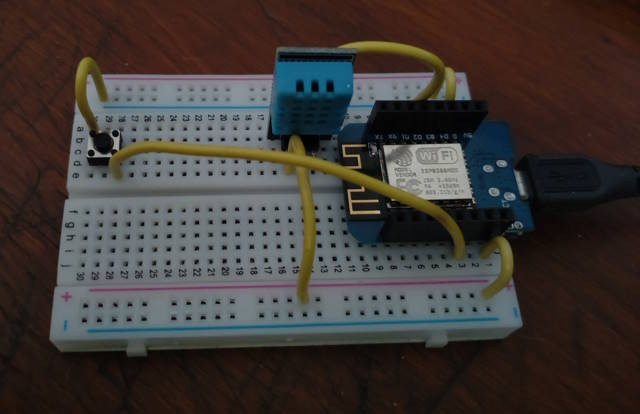

# ESP-FLUX-TEMP

ESP-FLUX-TEMP is firmware for sending temperature to [InfluxDB](https://www.influxdata.com/) time series data platform.
Firmware supports [on-premise InfluxDB](https://www.influxdata.com/get-influxdb/) version 2.x and [cloud-native service](https://cloud2.influxdata.com/login).

## Features

* ESP8266 platform (Wemos D1 Lite)
* Runtime configuration via web browser, using WiFi Manager. Configuration captive portal is started automatically when configured WiFi is not available.
* Compile time features selection (see config.h)
  * [x] Use file secrets.h for secret default values (configuration of InfluxDB connection parameters)
  * [x] Use built-in LED for blinking every measure and for other statuses such as configuration fail
  * [x] Use "configuration" button for start AP mode and configuration portal. Useful for "testing" and "roaming" solution.
  * [x] Use DHT sensor. Tested on [DHT11 sensor](https://www.laskakit.cz/arduino-senzor-teploty-a-vlhkosti-vzduchu-dht11--modul/) for temperature and humidity measurement.
  * [x] Use [BMP280](https://www.laskakit.cz/arduino-senzor-barometrickeho-tlaku-a-teploty-bmp280/) temperature and air pressure sensor.
  * [ ] Planned DS18B20 sensor.
  * [ ] Planned [BME280 sensor](https://www.laskakit.cz/arduino-senzor-tlaku--teploty-a-vlhkosti-bme280/).

## Limitations

* Only InfluxDB version 2.x is supported
* Skip server certificate validation (currently not planned, but may be in the future)
* No internal web server (and not planned)
* Not optimized for power consume (deep sleep and etc, but may be in the future)

## Schematic diagram

or browsable version [on Circuit Diagram](https://crcit.net/c/c36b5ea58b0f4e10a57509fa69e98ac0)

Full schematic with all features connected to Wemos D1 Mini. Choose compile time feature and required hardware.

## Libraries

The following external libraries are required:

* [ArduinoJson](https://arduinojson.org/)
* [WiFiManager](https://github.com/tzapu/WiFiManager)
* [ESP8266 Influxdb](https://github.com/tobiasschuerg/InfluxDB-Client-for-Arduino)
* [DHT sensor library](https://github.com/adafruit/DHT-sensor-library)

## Other resources

* [Time zones](https://github.com/nayarsystems/posix_tz_db/blob/master/zones.csv) for server certificate validation. Remember it for far future.

## Credits

* Huge credit [Altair's  ESP-TMEP](https://github.com/ridercz/ESP-TMEP) for base code for [WiFiManager](https://github.com/tzapu/WiFiManager) and run-time configuration.
* [ESP8266 DHT11/DHT22 Temperature and Humidity Web Server with Arduino IDE](https://randomnerdtutorials.com/esp8266-dht11dht22-temperature-and-humidity-web-server-with-arduino-ide/)
* [Complete Guide for DHT11/DHT22 Humidity and Temperature Sensor With Arduino](https://randomnerdtutorials.com/complete-guide-for-dht11dht22-humidity-and-temperature-sensor-with-arduino/)
* [Dew Point Calculator](http://www.dpcalc.org/index.php)
* [Uptime and ESP8266](https://www.snad.cz/en/2018/12/21/uptime-and-esp8266/)
